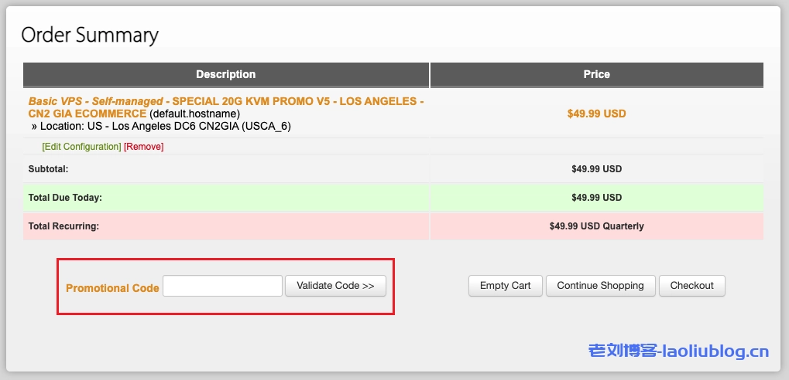

# BandwagonHost 2025 Promo Codes: Save 6.77% on Premium VPS Plans Starting at $35.4/Year

Looking for reliable VPS hosting that won't break the bank? Whether you're running a personal blog, deploying applications, or need a stable proxy server, getting the right VPS at the right price matters. This guide walks you through the latest BandwagonHost discount codes and helps you pick a plan that actually fits your needs—no fluff, just practical info.

---

## Current Active Promo Code

Here's what's working right now:

**BWHCGLUKKB** – 6.77% off, works on renewals too

Yeah, 6.77% might not sound earth-shattering, but here's the thing: it applies to renewals. Most hosting companies jack up prices after year one. Not here. The price you see is what you'll keep paying.

## How to Actually Use the Code

Pretty straightforward:

1. Pick your VPS plan on BandwagonHost
2. Find the "Promotional Code" box during checkout
3. Type in **BWHCGLUKKB**
4. Click "Validate Code"

Once validated, you'll see the discount applied immediately. The system remembers your code for renewals automatically—no need to dig it up again next year.

## Which Plan Should You Get?

Look, there's no "best" plan—just what works for your situation. Here's the breakdown:

### Los Angeles CN2 GIA-E – The Daily Driver

This is the workhorse. The DC6 CN2 GIA datacenter offers solid performance without the premium price tag. You can switch between multiple datacenters (DC6, DC9, Netherlands 9929) if you need different routing options.

Good for: General use, small to medium traffic sites, development servers

Curious about whether CN2 GIA routing actually makes a difference for your location? The performance gap between standard and premium routing can be substantial, especially during peak hours. 👉 [See how BandwagonHost's CN2 GIA network handles real-world traffic conditions](https://bandwagonhost.com/aff.php?aff=79616)

### Hong Kong CN2 GIA – When Budget Isn't the Issue

MEGA2 datacenter in Hong Kong. Supports China Telecom CN2 GIA, China Unicom, and China Mobile direct connections. Lower latency to Asian regions, but you're paying for that proximity.

Good for: Businesses targeting Asian markets, users who need minimal latency to mainland China

### Tokyo CN2 GIA – The Sweet Spot for Many

Equinix TY8 datacenter. Similar routing quality to Hong Kong but often with better availability. Supports CN2 GIA, Unicom 9929, and Mobile CMI routes.

Good for: Asian traffic with Japanese server preference, balanced performance and cost

Setting up your first VPS and wondering about the actual setup process? From initial configuration to optimizing for your specific use case, having a reliable host matters more than most people realize. 👉 [Check out BandwagonHost's straightforward setup and management interface](https://bandwagonhost.com/aff.php?aff=79616)

## Common Questions

**Q: Does the promo code work for everyone?**

A: Yes, both new and existing customers can use it. No special requirements.

**Q: What if I forgot to use the code during purchase?**

A: Unfortunately, you can't apply it after checkout. You could try contacting support, but no promises. Better to double-check before completing your order.

**Q: Can I switch datacenters after purchase?**

A: Depends on your plan. CN2 GIA-E plans typically allow datacenter switching. Check your specific plan's features before assuming.

---

## Wrapping Up

BandwagonHost isn't trying to be everything to everyone. They focus on reliable VPS hosting with good routing to Asia, straightforward pricing, and no surprise fees. The 6.77% discount isn't huge, but it's honest—and it sticks around for renewals.

Whether you go with the budget-friendly Los Angeles option or splurge on Hong Kong's low latency, you're getting transparent pricing and solid infrastructure. For most users running sites, apps, or proxies that need dependable performance without the enterprise price tag, that's exactly what matters. Want to see which datacenter works best for your specific needs? 👉 [Explore BandwagonHost's full range of VPS options and test their network](https://bandwagonhost.com/aff.php?aff=79616)
